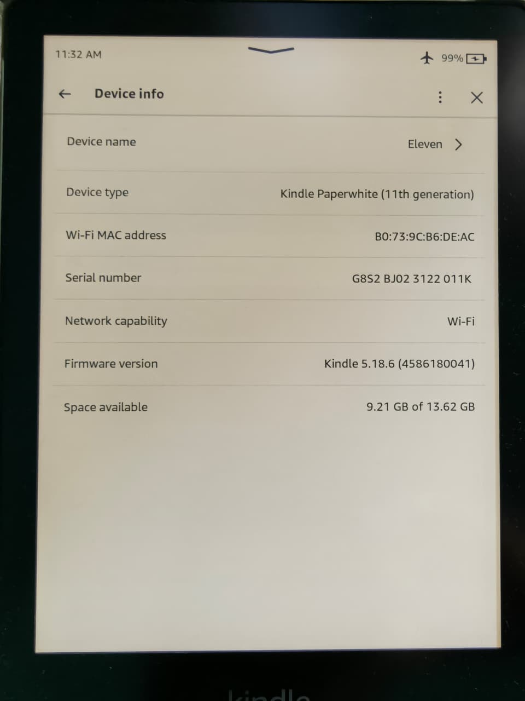
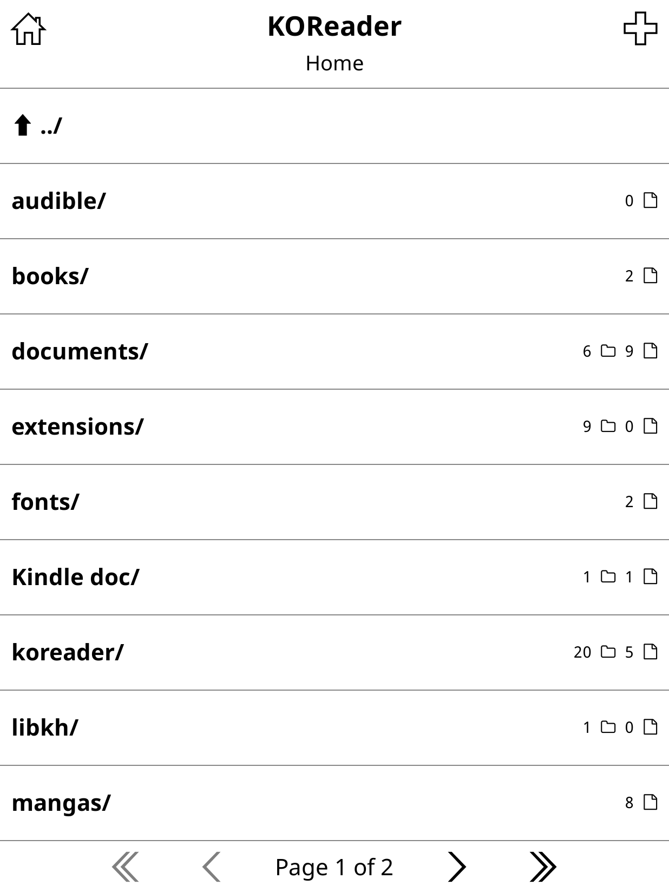
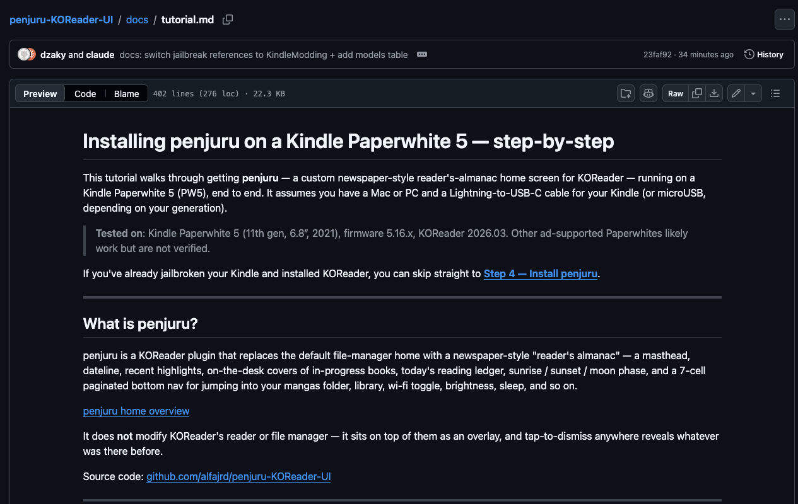
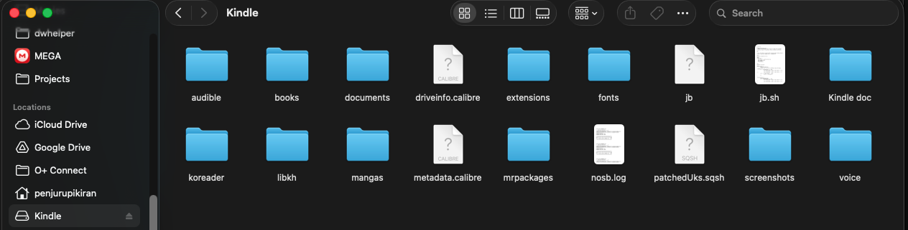
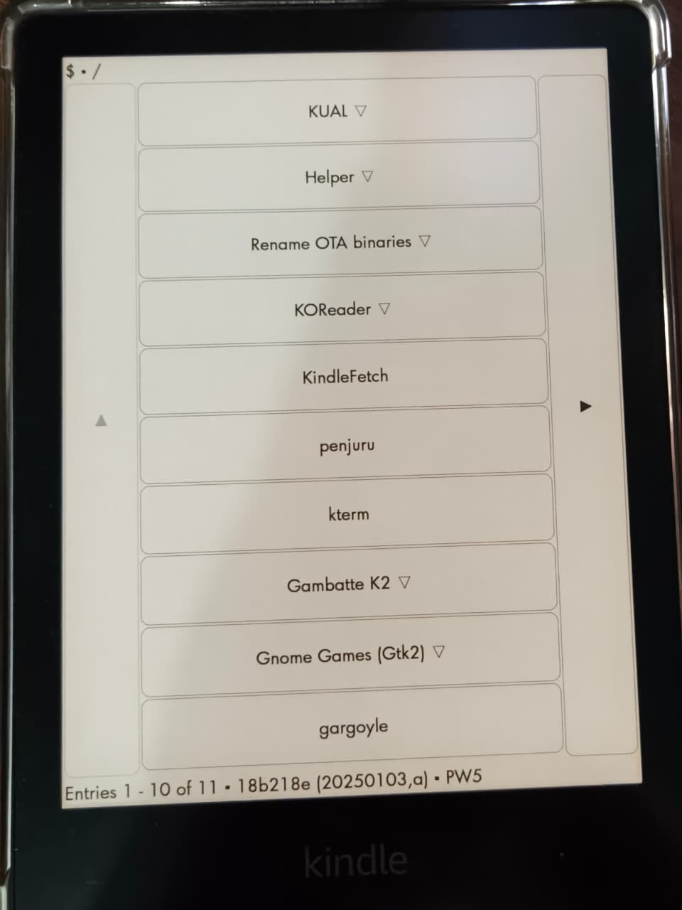
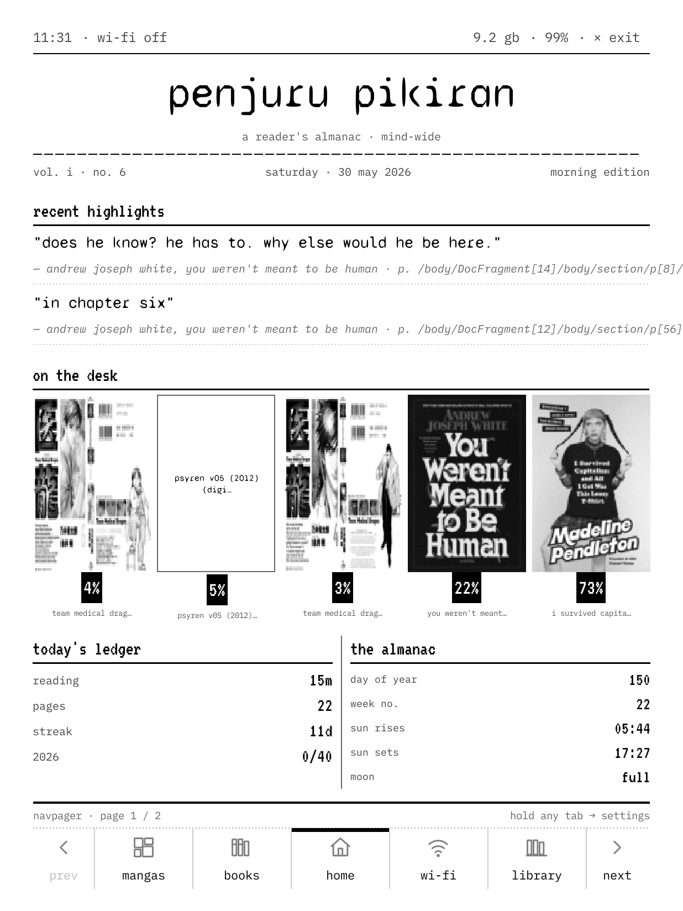
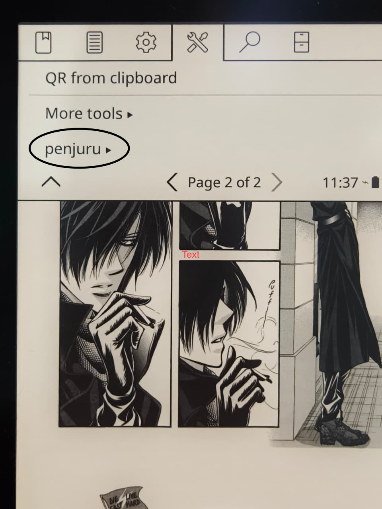
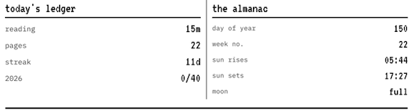
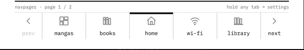
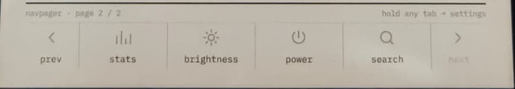

# Installing penjuru on a Kindle Paperwhite 5 — step-by-step

This tutorial walks through getting **penjuru** — a custom newspaper-style reader's-almanac home screen for KOReader — running on a Kindle Paperwhite 5 (PW5), end to end. It assumes you have a Mac or PC and a Lightning-to-USB-C cable for your Kindle (or microUSB, depending on your generation).

> **Tested on**: Kindle Paperwhite 5 (11th gen, 6.8″, 2021), firmware 5.16.x, KOReader 2026.03. Other ad-supported Paperwhites likely work but are not verified.

If you've already jailbroken your Kindle and installed KOReader, you can skip straight to **[Step 4 — Install penjuru](#step-4--install-penjuru)**.

---

## What is penjuru?

penjuru is a KOReader plugin that replaces the default file-manager home with a newspaper-style "reader's almanac" — a masthead, dateline, recent highlights, on-the-desk covers of in-progress books, today's reading ledger, sunrise / sunset / moon phase, and a 7-cell paginated bottom nav for jumping into your mangas folder, library, wi-fi toggle, brightness, sleep, and so on.


<!-- SCREENSHOT: full penjuru home screen on the device or emulator, all modules visible. -->

It does **not** modify KOReader's reader or file manager — it sits on top of them as an overlay, and tap-to-dismiss anywhere reveals whatever was there before.

Source code: [github.com/alfajrd/penjuru-KOReader-UI](https://github.com/alfajrd/penjuru-KOReader-UI)

---

## Prerequisites

You need **all four** of these in place before installing penjuru:

| # | Component | Why | Get it from |
|---|-----------|-----|-------------|
| 1 | Jailbroken Kindle | Lets you run third-party launchers and KOReader | [MobileRead jailbreak guide](https://www.mobileread.com/forums/forumdisplay.php?f=150) |
| 2 | KUAL (Kindle Unified Application Launcher) | The launcher you tap penjuru from | [KindleModding guide](https://kindlemodding.org/jailbreaking/post-jailbreak/installing-kual-mrpi/) |
| 3 | MRPI (MobileRead Package Installer) | Helps install other .bin packages cleanly | Bundled in same guide as KUAL above |
| 4 | KOReader | The reader engine penjuru is a plugin for | [KOReader install on Kindle](https://github.com/koreader/koreader/wiki/Installation-on-Kindle-devices) |

### Step 1 — Jailbreak your Kindle

Jailbreaking lets the Kindle execute third-party launchers. The MobileRead community maintains the canonical guides for each model and firmware combination — **find your exact Kindle model number and current firmware version first**, then follow the matching thread:

1. On your Kindle: **Home → Menu → Settings → Device Options → Device Info**. Note the model (e.g. *Paperwhite (11th Generation)*) and software version (e.g. *5.16.6*).
2. Search the [MobileRead Kindle Developer's Corner](https://www.mobileread.com/forums/forumdisplay.php?f=150) for your model + firmware combination.
3. Follow that thread's exact instructions. Jailbreaks are model-and-firmware-specific — using the wrong one can brick your device.


<!-- SCREENSHOT: phone-photo of your Kindle showing Settings → Device Options → Device Info. -->

> **If you already updated past a supported firmware**, you may need to downgrade. Most jailbreak threads have downgrade instructions; follow them carefully.

### Step 2 — Install KUAL and MRPI

KUAL is the launcher you'll tap penjuru from. MRPI helps install other packages. Both are typically bundled together as `.bin` packages.

Follow this guide step by step: **[Installing KUAL & MRPI — KindleModding](https://kindlemodding.org/jailbreaking/post-jailbreak/installing-kual-mrpi/)**.

The summary version:

1. Plug your Kindle into your computer with a USB cable.
2. Open the Kindle's USB drive on your computer.
3. Copy the KUAL `.bin` package to the root of the Kindle's USB drive (NOT into a folder).
4. Eject the Kindle, unplug.
5. On the Kindle: **Home → Menu → Settings → Menu → Update Your Kindle**. The Kindle will reboot and install the package.
6. Repeat for MRPI.

After both are installed, **search for "KUAL"** on the Kindle (search icon at the top). Tapping it opens the launcher menu.


<!-- SCREENSHOT: phone-photo of the KUAL menu open on your Kindle, before penjuru is added. -->

### Step 3 — Install KOReader

penjuru is a KOReader plugin, so KOReader has to be installed first.

Official guide: **[KOReader installation on Kindle devices](https://github.com/koreader/koreader/wiki/Installation-on-Kindle-devices)**.

Summary:

1. Download the latest KOReader Kindle build: [koreader/koreader releases](https://github.com/koreader/koreader/releases) → find the `koreader-*kindle*.zip` for the latest version.
2. Connect Kindle to computer.
3. Unzip the archive directly to the Kindle's USB drive root. After unzipping you should have `/mnt/us/koreader/` containing `koreader.sh`, `reader.lua`, etc.
4. Eject + unplug.
5. Open KUAL on the Kindle. You should see a **KOReader** menu item (KOReader ships its own KUAL extension). Tap it → KOReader boots.


<!-- SCREENSHOT: KOReader's file manager view, first launch. Take this from the emulator: it boots into the file manager by default. -->

If you can open and close a book in KOReader, you're good to install penjuru.

---

## Step 4 — Install penjuru

Now the actual penjuru install. Two pieces ship together: the **plugin** (the home screen and all logic) and the **KUAL extension** (a one-tap launcher that auto-opens the penjuru home when KOReader boots).

### 4.1 — Download the release

Go to the latest release page:

→ **[github.com/alfajrd/penjuru-KOReader-UI/releases](https://github.com/alfajrd/penjuru-KOReader-UI/releases)**

Download both files:

- `penjuru.koplugin.zip` — the plugin itself
- `penjuru-kual.zip` — the KUAL launcher entry


<!-- SCREENSHOT: GitHub releases page in your browser, both zips highlighted. -->

### 4.2 — Connect your Kindle

Plug your Kindle into your computer with USB. The Kindle should mount as a USB drive (something like `KINDLE` on Mac or `E:\` on Windows). If your Kindle is in KOReader, exit to the Kindle home first.


<!-- SCREENSHOT: macOS Finder or Windows Explorer showing the Kindle volume, contents visible. -->

### 4.3 — Install the plugin

Unzip `penjuru.koplugin.zip` directly into the Kindle's KOReader plugins folder:

```
<Kindle USB drive>/koreader/plugins/
```

After unzipping you should have:

```
<Kindle USB drive>/koreader/plugins/penjuru.koplugin/
  ├── _meta.lua
  ├── main.lua
  ├── pen_homescreen.lua
  ├── pen_topbar.lua
  ├── pen_bottombar.lua
  ├── pen_actions.lua
  ├── pen_tabs.lua
  ├── pen_widgets.lua
  ├── pen_data.lua
  ├── pen_dates.lua
  ├── pen_almanac.lua
  ├── pen_book_open.lua
  ├── pen_install_date.lua
  ├── pen_status.lua
  ├── pen_style.lua
  ├── pen_settings_defaults.lua
  ├── pen_menu.lua
  ├── pen_icons.lua
  ├── pen_fonts.lua
  ├── pen_quickactions.lua
  ├── pen_store.lua
  ├── pen_i18n.lua
  ├── pen_titlebar.lua
  ├── pen_core.lua
  ├── pen_config.lua
  ├── home_modules/
  ├── fonts/
  ├── icons/
  └── scripts/
```

> ⚠️ The folder name **must** end in `.koplugin` for KOReader to recognize it.

### 4.4 — Install the KUAL extension

Unzip `penjuru-kual.zip` into the Kindle's root. After unzipping you should have:

```
<Kindle USB drive>/extensions/penjuru/
  ├── config.xml
  ├── menu.json
  └── run.sh
```

This is what makes "penjuru" appear in the KUAL menu.

### 4.5 — Clean up macOS metadata (Mac users only)

macOS sprinkles `._*` AppleDouble files alongside everything it touches on FAT32 drives like the Kindle. These confuse KOReader and KUAL. Open Terminal and run:

```sh
find /Volumes/Kindle -name '._*' -delete
```

(adjust the path if your Kindle mounts as a different name).

### 4.6 — Eject and unplug

Eject the Kindle properly before unplugging:

- **macOS**: drag to Trash, or right-click → Eject in Finder.
- **Windows**: tray icon → Safely Remove Hardware.

---

## Step 5 — First launch

On the Kindle:

1. Open **KUAL** (search for "KUAL" if you don't see a shortcut).
2. You should see **penjuru** at or near the top of the menu.

   
   <!-- SCREENSHOT: phone-photo of KUAL menu with `penjuru` listed. -->

3. Tap **penjuru**. KOReader boots and within ~1 second the penjuru home overlay appears.

   
   <!-- SCREENSHOT: phone-photo OR emulator screenshot of the penjuru home immediately after launch. -->

### Enable the plugin (one-time, only if it didn't auto-load)

If you tap penjuru in KUAL and KOReader boots but no home overlay appears, the plugin isn't enabled. Enable it:

1. KOReader's hamburger menu (top right) → **Tools** → **Plugin management**.
2. Scroll to **penjuru**. Tap to enable.
3. Restart KOReader when prompted.
4. Re-launch from KUAL.


<!-- SCREENSHOT: KOReader's Plugin management screen with penjuru highlighted. From the emulator. -->

---

## Step 6 — Look around

Once the home is up, here's the lay of the land:

### Top status bar
`10:42 · wi-fi    2.1 gb · 84% · × exit`

Clock, wi-fi state, free disk, battery. Tap the **× exit** pill at the top-right to quit KOReader cleanly back to KUAL (or Kindle home, depending on your config).

### Masthead + dateline
`penjuru pikiran` over `a reader's almanac`, with a roman-numeral volume and ISO-style date below. The volume is calculated from your install date — your personal "reader's almanac" issue number.

### Recent highlights
The two most recent annotations from your reading. **Tap a quote** → home closes, book opens at the highlighted page.

### On the desk
Up to 5 covers of in-progress books, with percent-read bands and titles. **Tap any cover** → home closes, that book opens at last position. Books without an embedded cover render a clean bordered card with title + author.


<!-- SCREENSHOT: zoomed crop of the on-the-desk row showing cover thumbnails. -->

### today's ledger | the almanac
Side-by-side two-column row. Left: today's reading minutes, pages, streak, and progress toward your annual goal. Right: day of year, ISO week, sunrise / sunset (configurable location), moon phase.


<!-- SCREENSHOT: zoomed crop of the ledger | almanac side-by-side row. -->

### Bottom nav
7-cell paginated bar:

- **Page 1**: prev · mangas · books · home · wi-fi · library · next
- **Page 2**: prev · stats · brightness · power · search · next

Tap a tab → home closes, the action fires:

- **mangas** → file manager jumps to `/mnt/us/mangas/`
- **books** → `/mnt/us/books/`
- **home** → refreshes penjuru home
- **wi-fi** → toggles Wi-Fi
- **library** → file manager root
- **stats** → reading-history calendar
- **brightness** → frontlight slider
- **power** → device sleep (book cover screensaver)
- **search** → file search

Tap `<` and `>` chevrons to flip pages.


<!-- SCREENSHOT: bottom nav page 1 close-up. -->


<!-- SCREENSHOT: bottom nav page 2 close-up. -->

---

## Step 7 — Configure (optional)

penjuru ships with sensible defaults. To change them:

**Hamburger → Tools → penjuru → Settings**:

- **Annual reading goal**: integer, defaults to 40 books/year. Used by today's-ledger module.
- **Location** (latitude, longitude, timezone): drives sunrise / sunset and moon phase in the almanac. Defaults to Sleman, Yogyakarta (-7.7167, 110.3500, +7).
- **"Newly catalogued" threshold**: days, defaults to 30. (Module unmounted by default in current layout but configurable for when it's re-enabled.)


<!-- SCREENSHOT: penjuru's Settings sub-menu inside KOReader. Take from emulator. -->

---

## Troubleshooting

### "penjuru" doesn't appear in KUAL
- The `extensions/penjuru/` folder must contain `config.xml`, `menu.json`, and `run.sh`. If `config.xml` is missing KUAL silently skips the extension.
- Refresh KUAL by closing and reopening it.

### KUAL shows penjuru, KOReader opens, but no home overlay
- Plugin isn't enabled. Go to **Tools → Plugin management** and toggle on `penjuru`.
- Verify the plugin folder is at `koreader/plugins/penjuru.koplugin/` (NOT nested, NOT renamed).

### "tap-to-open" doesn't open a book
- For mobi/epub books without an embedded cover, the desk shows a title-only placeholder card. Tap should still work.
- If literally nothing happens, the in-progress book might no longer exist on the device. Try opening it from the file manager first to refresh KOReader's history.

### Manga / .mobi covers don't render
- Browse to the file in KOReader's file manager once. The CoverBrowser plugin populates a SQLite cache that penjuru reads from.
- Manga distributed as MOBI without an embedded cover declaration can't be auto-rendered — they fall back to title-only placeholders. (KOReader limitation, not a penjuru bug.)

### KOReader's screensaver shows for a moment, then Kindle's bookshelf takes over
- Your Kindle has Special Offers (ads). Amazon's `ad_screensaver` framework module overrides KOReader's. Standard fix: install the MobileRead **Screensaver Hack** for your model. Not part of penjuru.

### Sunrise / sunset wrong
- Set your location: **Tools → penjuru → Settings → Location**.

### KOReader behaves weirdly after a crash
- Check `/mnt/us/koreader/crash.log` for `pen_data:` lines. Paste them on the [GitHub issues page](https://github.com/alfajrd/penjuru-KOReader-UI/issues).

---

## Uninstall

1. Connect Kindle to computer.
2. Delete `<Kindle USB drive>/koreader/plugins/penjuru.koplugin/`.
3. Delete `<Kindle USB drive>/extensions/penjuru/`.
4. Eject + unplug.
5. Open KOReader. The plugin is gone; the file manager is back as the default landing view.

Your KOReader settings file may still have a `penjuru` settings key — harmless. Delete it manually from `/mnt/us/koreader/settings.reader.lua` if you wish.

---

## Reporting bugs or suggesting features

Open an issue at **[github.com/alfajrd/penjuru-KOReader-UI/issues](https://github.com/alfajrd/penjuru-KOReader-UI/issues)** with:

- Your Kindle model (Settings → Device Info)
- Kindle firmware version
- KOReader version (Tools → Help → About)
- A description of what you expected vs. what happened
- If KOReader crashed: the contents of `/mnt/us/koreader/crash.log`

---

## Screenshot capture cheat sheet

Want to update the screenshots above with your own setup? Most can be taken right from the KOReader emulator:

### From the emulator (Mac)
```sh
cd ~/Developer/koreader
export PATH="/opt/homebrew/opt/make/libexec/gnubin:/opt/homebrew/bin:$PATH"
bash ./kodev run
```

The penjuru plugin is symlinked into the emulator at `koreader-emulator-*/koreader/plugins/penjuru.koplugin`, so any change you make in the source is live. Inside the running emulator:

- **Hamburger → Tools → Take screenshot** — saves a PNG to `koreader-emulator-*/koreader/screenshots/`.
- For the penjuru home specifically: **Hamburger → Tools → penjuru → Open home**, then take the screenshot.

### From the device
- Tap the four corners of the screen simultaneously (KOReader's built-in shortcut). PNG lands in `/mnt/us/koreader/screenshots/`.
- Or take a phone photo — works well for showing the KUAL menu, the Kindle's native UI, and the device + cable / hardware setup.
